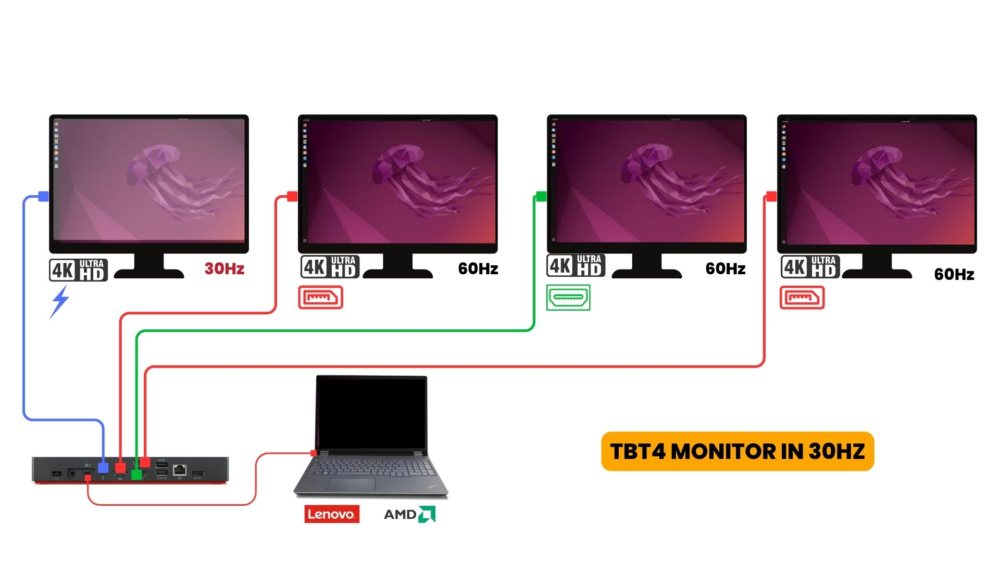
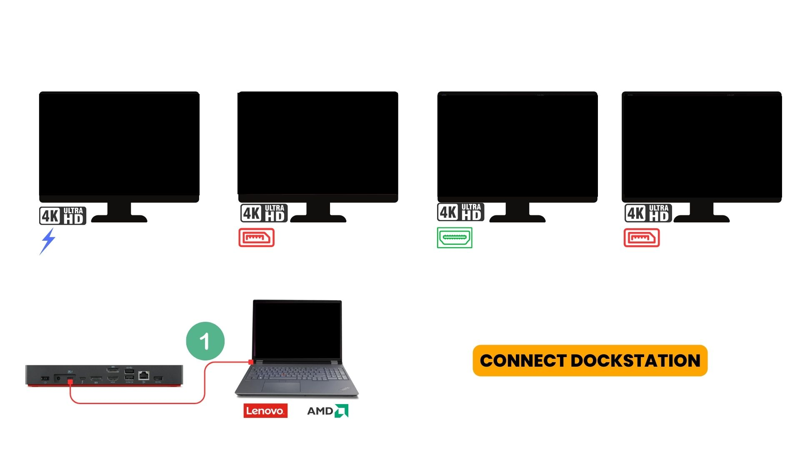
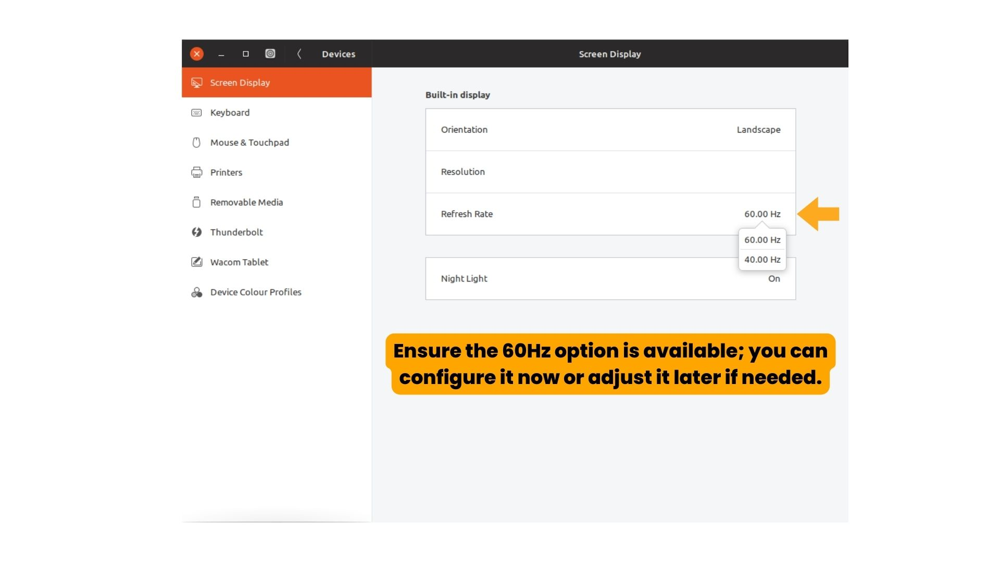
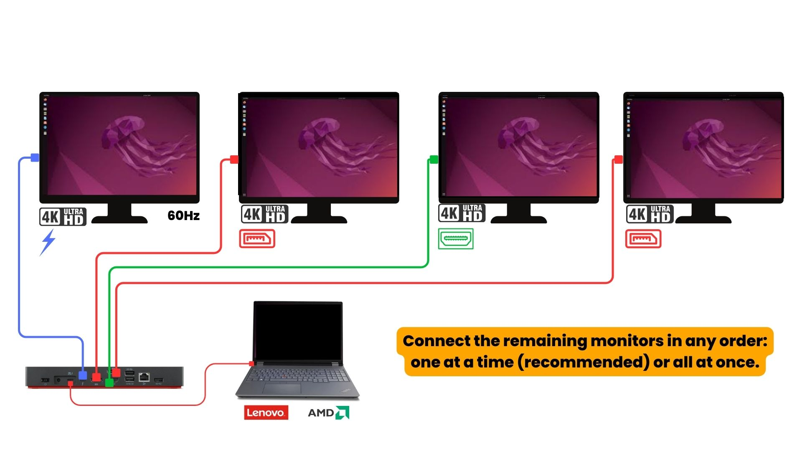
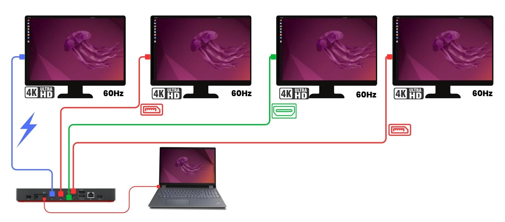

# Connecting a Lenovo Laptop with Linux OS to a Dock Station for Four Monitors at 60Hz

This guide explains how to connect a Lenovo laptop running Linux OS with **AMD GPU drivers** to a dock station with four monitors and achieve a 60Hz refresh rate for all displays. Follow these steps carefully for optimal setup.

---

## Introduction
Below is a visual overview of the setup, illustrating the dock station, laptop, and connected monitors when not possible to set all 4 monitors in 60Hz (TBT monitor in 30Hz):

---

## Steps to Configure

### **Step 1: Connect the Dock to the Laptop**
Begin by securely connecting the dock station to your Lenovo laptop using the appropriate cable (usually USB-C or Thunderbolt). Ensure the dock station is powered on and recognized by your system.

---

### **Step 2: Connect the Thunderbolt (TBT) Monitor**
1. Connect the Thunderbolt monitor to the dock station. 
   - It should be connected **first**, **second**, or **third**.
   - **Important**: The Thunderbolt monitor **must not be the last monitor connected**.

2. After connecting the Thunderbolt monitor:
   - Open your **Linux display settings**.
   - Verify if the **60Hz refresh rate option appears** for this monitor.
   - If the option does not appear:
     - Ensure the Thunderbolt cable is securely connected.
     - Check that the monitor and dock support 60Hz over Thunderbolt.
     - Restart the dock station and laptop if necessary.
       

---

### **Step 3: Connect the Remaining Monitors**
The order of connecting the remaining monitors (HDMI and DisplayPort) **does not matter**. You can connect them to their respective ports in any sequence:
- HDMI port for one monitor.
- DisplayPort (DP) ports for two monitors.

While connecting one at a time is recommended for smoother setup, connecting them all at once is also fine.

---

### **Step 4: Configure the Monitors**
1. Open **Linux Display Settings**.
2. Verify that all monitors are detected.
3. For each monitor:
   - Set the refresh rate to **60Hz**.
   - Arrange the monitors to match your physical setup.
4. Apply the changes.

---

## Troubleshooting
- If the **60Hz refresh rate option** does not appear for any monitor:
  - Double-check all connections.
  - Restart the dock station and laptop.
  - Ensure your graphics drivers are up to date.

- Ensure the Thunderbolt monitor is connected first, second, or third, but **not last**.

---

## Visual Reference
Additional diagrams and references are located in the `docs` folder. This is the desired state (all monitors in 60Hz):

---

By following these instructions, you can set up your Lenovo laptop and dock station for four monitors at 60Hz. If you encounter any issues, double-check the steps, update your drivers, or consult the dock station's documentation.
